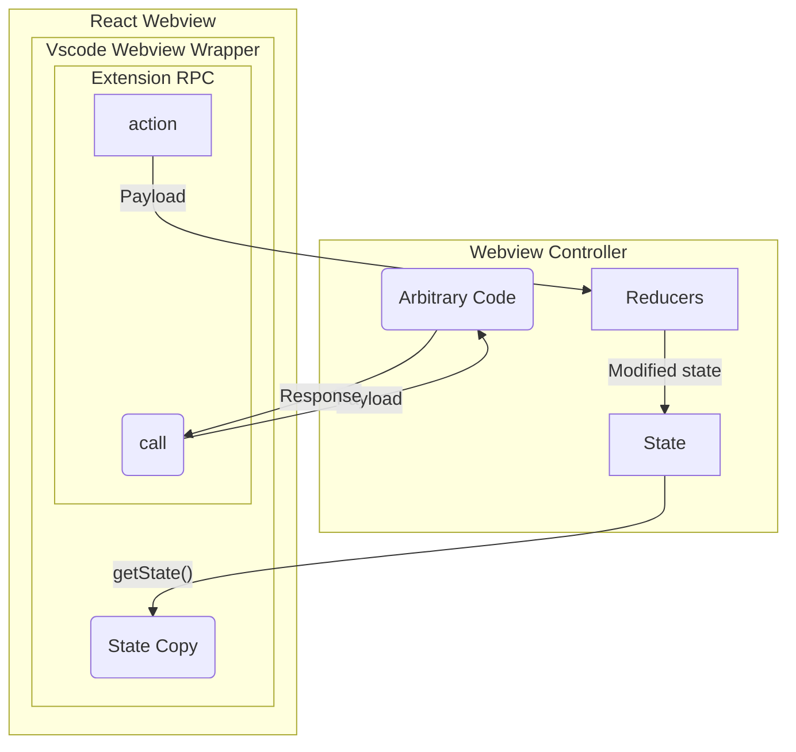

# React Webviews

This folder contains the React webviews for the extension. The wevbviews are used to add custom UI to extension features that are not possible to implement using the default VS Code UI and APIs.

## Architecture

The webviews are implemented using React and are rendered inside a vscode webivew iframe. For every feature the extension needs to implement a webview controller that manages the webview lifecycle, communication between the webview and the extension, and the webview state. The webview is responsible for the UI and the user interactions and displaying the state it receives from the controller.

Ideally, the webview should be a dumb component that only renders the UI and receives the state from the controller. The webview will call `actions` on the controller to make changes to the state. The controller will then update the state and send the updated state to the webview.

The webview can also make RPC calls to the extension to perform actions and get a response.




## Webview Structure

The webviews are organized in the following structure:

```
reactviews/
  ├── common/  # Contains common components used by multiple webviews
  ├── pages/       # Contains the webview pages. Each page is a separate webview for a specific feature
	  ├── index.tsx      # The main React component that renders the webview pages
```


All the webviews are rendered inside a div with the id `root` in the vscode webview iframe. The webview pages are rendered using the `ReactDOM.render` method in the `index.tsx` file.

Example:

```tsx
ReactDOM.createRoot(document.getElementById('root')!).render(
	<VscodeWebViewProvider>
		<Webview-Content>
		</Webview-Content>
	</VscodeWebViewProvider>
);
```

Every webview page needs to be wrapped inside the `VscodeWebViewProvider` component. This component provides the necessary context to the webview pages to interact with the vscode extension APIs like getting theme colors, getting webview state from the extension, performing state manipulation using reducers, making arbitrary RPC calls to the extension, etc.


